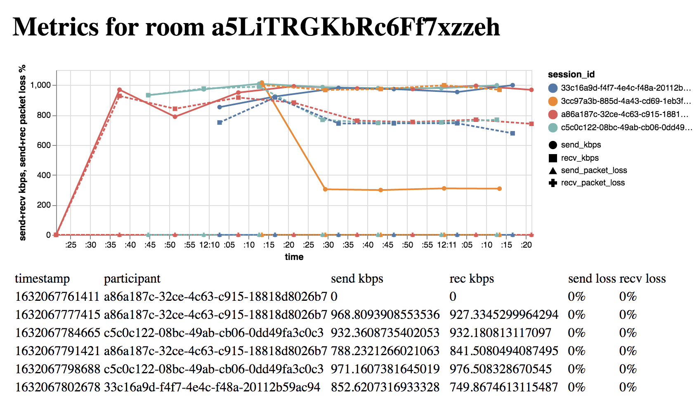
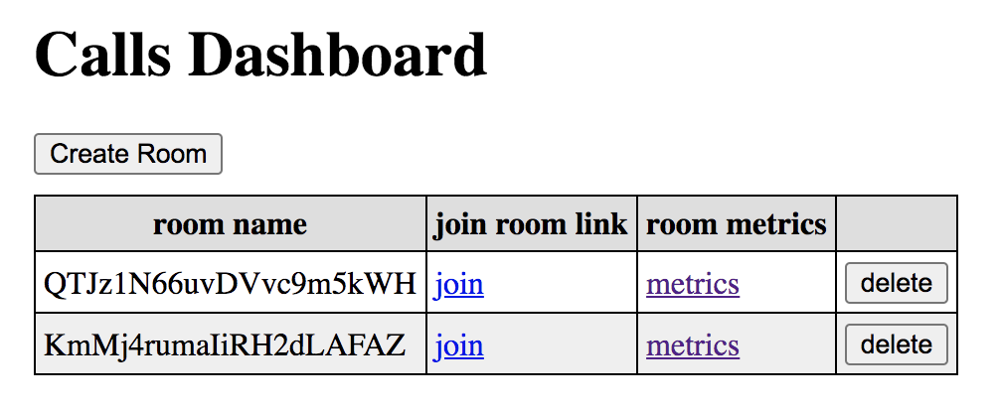

# Toy Metrics Collector

This project is a web app that interfaces with the [Daily video API](https://www.daily.co/) to create call rooms and store metadata about the quality of the calls. It generates a dashboard of all of the calls that have taken place, and graphically displays the metadata for any chosen call from the dashboard.

## Quick Start

Requires nodejs and sqlite. Put a Daily API Key in the env var `DAILY_API_KEY` and run the following:

```
git clone git@github.com:wcarss/toy-metrics-collector.git
cd toy-metrics-collector
npm install
npm run setup
npm start
```

Then visit http://localhost:35813 -- voila!

## Contents

- [The Daily API Key](#the-daily-api-key)
- [Running with Docker](#running-with-docker)
- [Running directly using nodejs](#running-directly-using-nodejs)
- [The Database](#the-database)
- [Troubleshooting](#troubleshooting)

## Screenshots

Here's what this project looks like when it's running!

### metrics page



### dashboard



## How to run this project locally

You can either run this project directly by installing its dependencies, or run it in a container using a container runtime like docker or podman, which will install the dependencies for you. Either way, you'll need a Daily API key first.

### The Daily API Key

To operate this project successfully, you will need a [Daily](https://www.daily.co/) account and an API key from them. Both the code and dockerfile assume you will have this key stored in an environment variable named `DAILY_API_KEY` in the context where the process runs.

In a terminal, you can supply the key at runtime by prepending it to a command like this:

```
DAILY_API_KEY="my key" npm start
```

But this is often considered dangerous, because the key (which is a secret) can be visible in places you might not expect, for example in the output of `ps` on your system. It is generally a better practice to add info like this to a file and `export` it into your environment when you need it. One place you could put it is in a file that runs when your terminal begins, like `~/.zshrc` or `~/.bashrc`. In my terminal's startup file, I have added a line like this:

```
export DAILY_API_KEY="my key"
```

Which sets the key in any terminal I'm running.

#### Note:

If you _just_ added that line to your terminal's startup file, the variable may not be in your environment yet! You need to re-run that startup file for each open terminal you have, and it normally only gets run when you open a terminal/log in. You can either close your terminals/log out and back in, or re-run the file manually in any terminal you care about, by running `source ~/.bashrc` (or whatever file you added it to). A handy short-hand for `source` is the dot-command, which you could run like this: `. ~/.bashrc`.

### Should I run with Docker or directly?

They work pretty much the same, so you should use whichever you're more comfortable with, docker or nodejs.

### Running with Docker

To run this project under docker, you need to have docker installed. On ubuntu, this can be done with a command like:

```
apt-get install docker.io
```

Which you may have to run using sudo to have permission. For MacOS or Windows, you should likely use the instructions found on the [Docker website](https://www.docker.com/), which may require you to make an account, which might be a reason to try an alternative container runtime like [podman](https://podman.io/). For other linux distributions, you should look up instructions specific to them, which are definitely out there.

Once you have docker installed, you can build a toy-metrics-collector image using this command, from inside of the toy-metrics-collector directory:

```
docker build -t toy-metrics-collector -f Dockerfile.development  .
```

Note that `docker build` requires a connection to the internet, and can use a lot of data. Once it completes, you will have an image tagged as 'toy-metrics-collector', which you can run with this command, also executed from within the toy-metrics-collector directory:

```
docker run -p 3030:35813 -e DAILY_API_KEY -v "$(pwd)/db":/usr/src/app/db toy-metrics-collector
```

That command has a few parts:

- `-p 3030:35813` is connecting the port `35813` inside of the docker container to your host's port `3030`, allowing you to visit `http://localhost:3030` on your host and communicate with the toy-metrics-collector service running on port `35813` inside of the container.
- `-e DAILY_API_KEY` is passing the environment variable `DAILY_API_KEY` into the docker container. Recall from above: you need to have an API key from the Daily video API for this project to run correctly, and you should set a variable in your terminal environment named `DAILY_API_KEY` to hold it.
- `-v "${pwd}/db":/usr/src/app/db wcarss/` is mounting a volume from your host into the container, to allow data added to the database while the container is running to persist after the container has stopped. This part of the command is why you should execute the command from within the toy-metrics-collector directory: toy-metrics-collector/db is where the project's configuration expects the sqlite database to be stored. If you know what you're doing, you could put a database elsewhere and run this command from there, or change the path accordingly.

That command runs the image in the foreground in your terminal, so you can monitor the logs directly. If you would like the image to be run by docker in the background and to stay running after you close the terminal (e.g. if you have ssh'd into a computer to run the container), you can add the `-d` flag to the command, like this:

```
docker run -d -p 3030:35813 -e DAILY_API_KEY -v "$(pwd)/db":/usr/src/app/db toy-metrics-collector
```

If successful, you should see something like this:

```
> toy-metrics-collector@0.0.0 start> toy-metrics-collector@0.0.0 migrate_start /usr/src/app
> knex migrate:latest && nodemon src/index.js

Using environment: development
Already up to date
[nodemon] 2.0.12
[nodemon] to restart at any time, enter `rs`
[nodemon] watching path(s): *.*
[nodemon] watching extensions: js,mjs,json
[nodemon] starting `node src/index.js`
toy metrics collector listening on port 35813
```

If you see the above, it means your server is running! You can now visit http://localhost:3030 (**note that it's port 3030, not 35813!**) in a web browser on your computer to see the toy metrics dashboard, create calls, and view call metrics.

#### Docker Command Administrivia

If you're running the container in the background using `-d`, you might want to know about the following commands:

- `docker ps` will show you the list of docker images that are running, and the name of this running container, something like `a8302f951946`
- `docker logs <container name>` will show you the logs that would be printed to the foreground if you had not run the container using `-d`
- `docker kill <container name>` will stop the process and the container. It will not delete the image you built, but the code will no longer be running. After running `docker kill <container name>`, you can re-run `docker run` again.
- `docker exec -it <container name> /bin/bash` will open a terminal up inside of the running container, which might be helpful for diagnosing problems

### Running directly using nodejs

To run this project directly, you must have [nodejs](https://nodejs.org/en/) (\~v14+) and a package manager for nodejs like [npm](https://www.npmjs.com/) or [yarn](https://yarnpkg.com/) installed. You also need to have the database program [sqlite3](https://www.sqlite.org/index.html) installed. On ubuntu, you can install them with commands like the following (nodejs includes npm with it).

```
apt-get update
apt-get install nodejs
apt-get install sqlite3
```

On MacOS or Windows, you might want to follow directions from each of the project's websites, or look up how best to install them. On my mac, I used [homebrew](https://brew.sh/) to install these, and I use the project [n](https://github.com/tj/n) to manage my nodejs installations.

Once you have a Daily API key in your environment and have nodejs+npm installed, you can install and run the project by cloning this repository, installing the js dependencies, setting up the database, and finally invoking the server command. The following commands accomplish all that:

```
git clone git@github.com:wcarss/toy-metrics-collector.git
cd toy-metrics-collector
npm install
npm run setup
npm start
```

If successful, you should see something like this:

```
> toy-metrics-collector@0.0.0 start
> nodemon server/index.js

[nodemon] 2.0.12
[nodemon] to restart at any time, enter `rs`
[nodemon] watching path(s): *.*
[nodemon] watching extensions: js,mjs,json
[nodemon] starting `node server/index.js`

toy metrics collector listening on port 35813
```

If you see the above, it means your server is running! You can now visit http://localhost:35813 in a web browser on your computer to see the toy metrics dashboard, create calls, and view call metrics.

## The Database

The database is a sqlite3 database, stored in the file `toy-metrics-collector/db/metrics.sqlite3`. You can directly query it using sqlite3, using a command like the following from inside of the toy-metrics-collector directory to log into the database:

```
sqlite3 ./db/metrics.sqlite3
```

Using the sqlite3 command line to interact with databases is a big topic and outside the scope of this file, but they have [a guide](https://www.sqlite.org/cli.html).

You can make a backup of the database by just copying the file, and you can delete the file to clear any stored data. If you delete the file, you may need to run the migrations again to set up a new database and set up its schema. If you are running the project with Docker, it will automatically run the migrations when you start the server. Otherwise, you can run them yourself with this command:

```
npm run setup
```

Then you can run the server as normal with `npm start`.

## Troubleshooting

### No Daily API Key / Key not set

If you see a line like this in the above program-start output,

```
no daily api key provided! all DailyAPI calls will fail.
```

It means your `DAILY_API_KEY` environment variable is not set correctly. See the section above 'The Daily API Key' for some suggestions on how to set it.

### No data being stored / shown

If you don't see any rooms when you join and clicking 'Create Room' doesn't seem to make one, you might have a Daily API key issue like the above. Try the steps there to see if it resolves your issue.

If you see rooms and can join them, but metrics data doesn't seem to be being stored or displayed, it's possible that the database migrations need to be run to set up (or fix up) the database. If you're using Docker, they'll be run automatically whenever you start the image. Otherwise, you can run them manually by stopping the server and then running this command:

```
npm run setup
```

Then, try running the server again with `npm start` and see if metrics data is now being stored/displayed.

## Other issues or questions

If any other problems are occurring, or if you have the issues above but the fixes aren't helping, or if you just have a question, open an issue on github or contact the project author, Wyatt Carss, at wyatt@wcarss.ca
