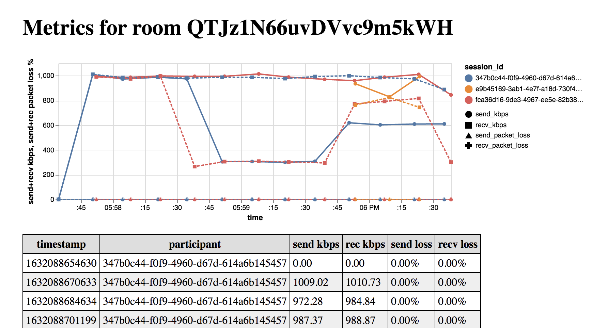

# Toy Metrics Collector

This project is a web app that interfaces with the Daily video API to create call rooms and store metadata about the quality of the calls. It generates a dashboard of all of the calls that have taken place, and graphically displays the metadata for any chosen call from the dashboard.

## Screenshots

metrics page:



dashboard:


## How to run this project locally

To run this project, you must have [nodejs](https://nodejs.org/en/) (~v14+) and a package manager for nodejs like [npm](https://www.npmjs.com/) or [yarn](https://yarnpkg.com/) installed. You also need to have the database program [sqlite3](https://www.sqlite.org/index.html) installed. You will also need a [Daily](https://www.daily.co/) account and an API key from them, stored in an environment variable named `DAILY_API_KEY` in the context where the process runs.

Once you have a Daily API key in your environment and hav nodejs+npm installed, you can install and run this server by cloning this repository, installing the nodejs dependencies, setting up the database, and finally invoking the server command. The following commands accomplish all that:

```javascripts
git clone https://github.com/wcarss/toy-metrics-collector.git
cd toy-metrics-collector.git
npm install
npm run setup
npm start
```

If successful, you should see something like this:

```
> toy-metrics-collector@0.0.0 start
> nodemon server/index.js

[nodemon] 2.0.12
[nodemon] to restart at any time, enter `rs`
[nodemon] watching path(s): *.*
[nodemon] watching extensions: js,mjs,json
[nodemon] starting `node server/index.js`

toy metrics collector listening on port 35813
```

If you see the above, it means your server is running! You can now visit http://localhost:35813 in a web browser on your computer to see the toy metrics dashboard, create calls, and view call metrics.

## Troubleshooting

If you see a line like this in the above program-start output,

```
no daily api key provided! all DailyAPI calls will fail.
```

It means your `DAILY_API_KEY` environment variable is not set correctly. You may have to look up "how to set environment variables" for your operating system + command line terminal program to figure out what is wrong.

## Questions?

If you have any questions about this project, please email its author, Wyatt Carss, at wyatt@wcarss.ca
